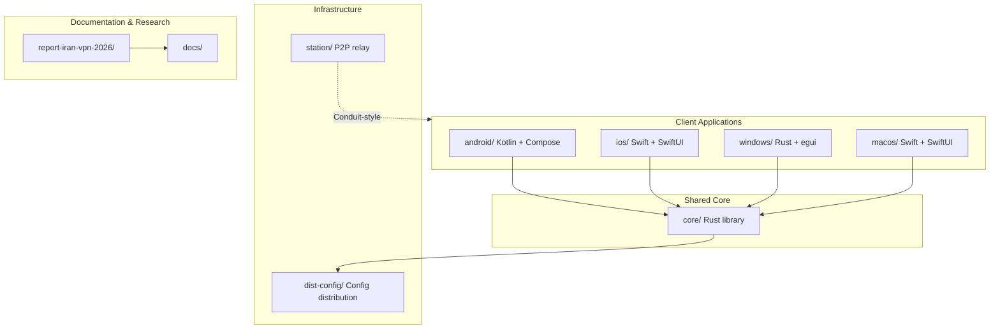
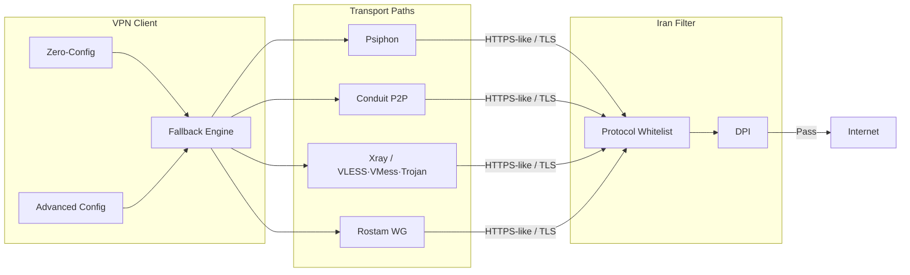
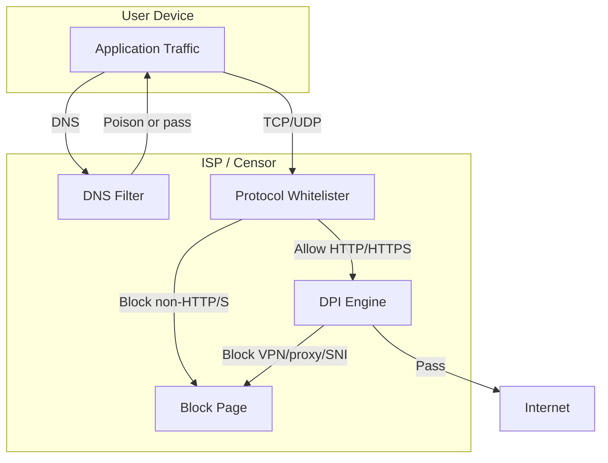
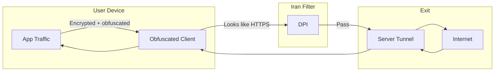

# Iran Circumvention VPN — Research & Application

[](report-iran-vpn-2026/README.md)
[](prd.md)
[](#building)

**Open source VPN for Iran filtering evasion:** multi-protocol fallback, zero-config, volunteer P2P relay. Built on [Iran VPN Research Report 2026](report-iran-vpn-2026/README.md).

---

## Overview

Iran maintains one of the world's most restrictive internet environments: DNS poisoning, DPI, protocol whitelisting (HTTP/HTTPS/DNS only), and over 6 million blocked domains. Standard VPNs (OpenVPN, plain WireGuard) are detected and blocked. This project provides:

- **Zero-config connection** — One tap/click; no server import required (US-001).
- **Automatic protocol fallback** — Psiphon → Conduit P2P → Xray/Rostam; switch in &lt;15s on failure (US-002, FR-6).
- **Multi-platform clients** — Android (Kotlin/Compose), iOS (Swift/SwiftUI), Windows (Rust/egui), macOS (Swift/SwiftUI).
- **Volunteer P2P station** — Conduit-style relay so diaspora can share bandwidth (US-004).
- **Decentralized config distribution** — Redundant sources so a single block doesn’t break zero-config (FR-8).

All tunnels use **HTTP/HTTPS or DNS** as outer transport to comply with Iran’s protocol whitelist; traffic is obfuscated to resemble normal web traffic.

---

## Architecture

### Repository layout



### High-level flow (client → censor → exit)



### Iran filtering system (why we need obfuscation)



### Circumvention flow (obfuscated tunnel)



---

## Project structure

| Path | Description |
|------|-------------|
| **[core/](core/)** | Rust shared library: fallback engine, config types (VLESS/VMess/Trojan/WireGuard), DoH stub, protocol registry, config fetch |
| **[android/](android/)** | Android app (Kotlin, Jetpack Compose): Connect/Disconnect, VPN tunnel, tun2socks, Psiphon/Xray/Conduit/Rostam path runners, legal disclaimer |
| **[ios/](ios/)** | iOS app (Swift/SwiftUI): NetworkExtension tunnel; see [ios/README.md](ios/README.md) |
| **[windows/](windows/)** | Windows app (Rust, egui): Wintun + core; see [windows/README.md](windows/README.md) |
| **[macos/](macos/)** | macOS app (Swift/SwiftUI): NEPacketTunnelProvider; see [macos/README.md](macos/README.md) |
| **[station/](station/)** | Volunteer P2P station (Conduit-style); see [station/README.md](station/README.md) |
| **[dist-config/](dist-config/)** | Config distribution (FR-8): redundant sources, `publish.sh` for S3/mirror |
| **[docs/](docs/)** | Legal disclaimer, protocol integration guide (US-007, US-008) |
| **[report-iran-vpn-2026/](report-iran-vpn-2026/)** | Full research report: filtering system, circumvention techniques, open source solutions, recommendations |

---

## Building

### Core (Rust)

```bash
cd core && cargo build
```

- **Android:** `./scripts/build-android-core.sh` (cargo-ndk or NDK); output to `android/app/src/main/jniLibs/`.
- **iOS:** build for `aarch64-apple-ios` / `x86_64-apple-ios`; use as XCFramework.
- **Windows / macOS:** host target.

### Android

1. Set `ANDROID_HOME` or add `local.properties` with `sdk.dir` (see `local.properties.example`).
2. Fetch tun2socks prebuilts: `./scripts/fetch-tun2socks-prebuilt.sh`.
3. (Optional) Build Rust core: `./scripts/build-android-core.sh`.
4. Open `android/` in Android Studio (or `./gradlew assembleDebug`).

See [android/README.md](android/README.md) for Psiphon/Xray and tun2socks.

### iOS / Windows / macOS

See the README in each directory for IDE setup, NetworkExtension/Wintun, and core integration.

---

## Research report (table of contents)

1. [Executive Summary](report-iran-vpn-2026/01-executive-summary.md)
2. [Iran's Filtering System](report-iran-vpn-2026/02-iran-filtering-system.md)
3. [VPN Circumvention Techniques](report-iran-vpn-2026/03-vpn-circumvention-techniques.md)
4. [Open Source Solutions](report-iran-vpn-2026/04-open-source-solutions.md)
5. [Recommendations](report-iran-vpn-2026/05-recommendations.md)
6. [References](report-iran-vpn-2026/06-references.md)
7. [Complete Report: Pros, Cons & Improvements](report-iran-vpn-2026/07-complete-report-pros-cons-improvements.md)
8. [GitHub Newest VPN Tech 2026](report-iran-vpn-2026/08-github-newest-vpn-tech-2026.md)

---

## Quick links

| Link | Description |
|------|-------------|
| [PRD](prd.md) | Product requirements (user stories, FR/NFR) |
| [Changelog](CHANGELOG.md) | Project version history |
| [Report Changelog](report-iran-vpn-2026/changelog.md) | Report version history |
| [Legal disclaimer & ops security](docs/legal-disclaimer.md) | US-008 |
| [Protocol integration guide](docs/protocol-integration.md) | US-007 |

---

## Legal notice

**Unauthorized VPN use is illegal in Iran** (Supreme Council of Cyberspace, February 2024).

This project is for **research and informational use only**. We do not encourage illegal activity. Users assume all legal and personal risks. See [docs/legal-disclaimer.md](docs/legal-disclaimer.md) and [report-iran-vpn-2026/05-recommendations.md](report-iran-vpn-2026/05-recommendations.md).

---

## License

See repository license file. Components (Psiphon, Xray, Conduit, etc.) have their own licenses.
