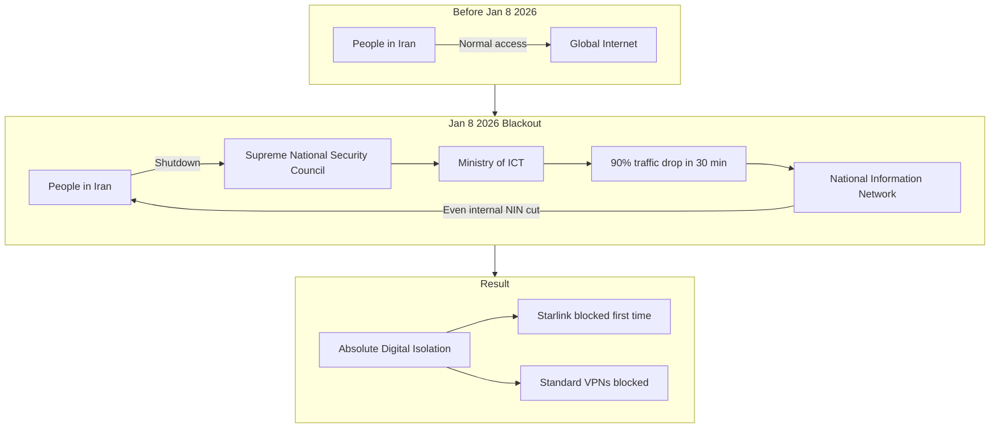
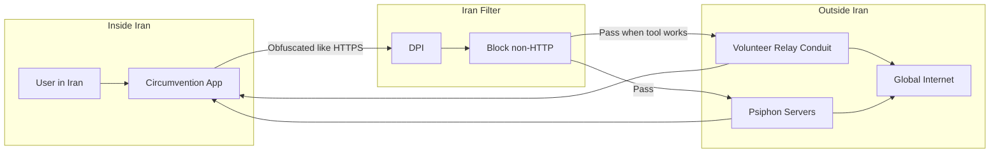
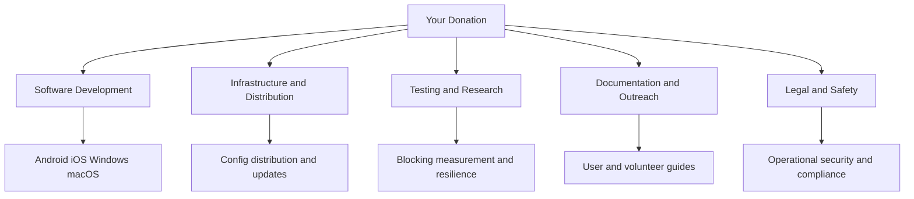
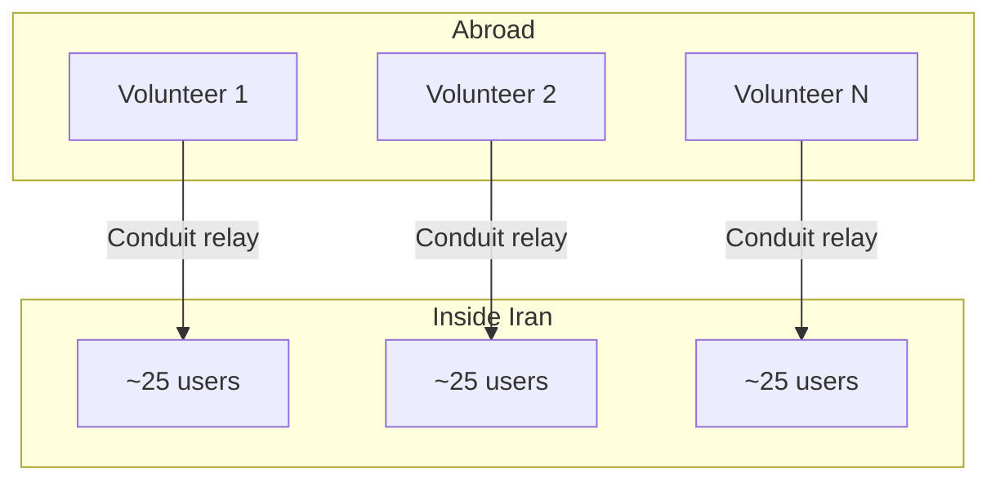

# GoFundMe Campaign Draft: Iran Internet Freedom — Open Circumvention Tools

**Platform:** GoFundMe (or similar)  
**Use:** Copy sections into campaign page; attach diagrams as images (export from Mermaid live editor or use screenshot).  
**Research period:** Iran internet situation, Jan–Feb 2026.

---

## Research Summary (Jan–Feb 2026)

- **Jan 8, 2026:** Iranian authorities imposed a near-total internet blackout (20:30 IRST). Within 30 minutes, traffic dropped by **90%**; connectivity fell to **1–3%** of normal. Major cities affected: Tehran, Isfahan, Shiraz, Kermanshah, Lordegan, Abdanan.
- **First-time Starlink blocking:** Satellite internet was blocked; only an estimated **3%** of Iranians could stay online via Starlink—and using it is now a crime.
- **National Information Network (NIN):** Iran’s domestic network was fully disconnected *even internally*. The regime is pursuing “**Absolute Digital Isolation**”—treating connectivity as a government-granted privilege, not a right.
- **Economic cost:** The government acknowledged **$35.7 million per day** in economic losses. Blackout was partially relaxed by **Jan 28**, but severe restrictions and filtering remain.
- **Purpose:** Suppress the 2025–2026 protests and obscure violence; DPI, protocol blocking (OpenVPN, IKEv2), and jamming make **standard VPNs largely ineffective**.
- **Circumvention in practice:** Open-source tools are critical. In one day in January 2026, **over half** of 2.8 million Psiphon Conduit connection attempts came from Iran, with **40,000+ Iranians connected at once**. Diaspora volunteers running Conduit can each help roughly **25 people** inside Iran at low bandwidth.

*Sources: Filter Watch, Cloudflare, Foreign Policy, NPR, TechCrunch, Iran International, Wikipedia “2026 Internet blackout in Iran,” Forbes, AGSI, Digital Watch Observatory.*

---

## 1. Campaign Title (Short)

**Option A:**  
**Help Keep Iran Connected — Open-Source Circumvention Tools**

**Option B:**  
**Iran Internet Freedom: Tools So People Stay Online**

**Option C:**  
**Break Iran’s Digital Blackout — Support Open Circumvention**

---

## 2. Tagline / Subtitle (one line under title)

**One sentence:**  
*When Iran shuts down the internet, open-source circumvention tools and volunteer relays are often the only way people can connect. We build and maintain those tools—your donation keeps them free and resilient.*

---

## 3. The Problem (Story Block 1)

In January 2026, Iran turned off the internet for millions of people.

Within half an hour of the switch, traffic across the country dropped by about 90%. For days, connectivity was near zero. For the first time, the government also blocked Starlink, the satellite link that had helped people communicate during earlier crackdowns. Major cities—Tehran, Isfahan, Shiraz, Kermanshah, and others—went dark. Iran’s own National Information Network was cut, even inside the country. The goal was clear: silence protest, hide violence, and push the country toward what experts call “Absolute Digital Isolation,” where going online is a privilege the state decides who gets.

Standard VPNs don’t work there anymore. The regime uses deep packet inspection, blocks common protocols, and jams satellite signals. People inside Iran need tools that are built specifically for this kind of censorship—and they need volunteers and infrastructure outside Iran that can keep those tools running when the grid goes dark.

---

## 4. Why Now (Story Block 2)

The blackout was partially relaxed by late January, but the situation is not back to normal. Severe restrictions and filtering remain. The government is investing heavily in a long-term “National Information Network” that will make it easier to cut the country off again. Each new crisis—protests, elections, unrest—can trigger another nationwide or regional shutdown. The need for reliable, open circumvention tools and volunteer-run relays is greater than ever.

In one day in January 2026, more than half of 2.8 million connection attempts to Psiphon Conduit—a volunteer relay system—came from Iran, with over 40,000 people connected at once. Each volunteer abroad can help roughly 25 people inside Iran. That’s the difference between total blackout and a thin but real lifeline. We want to strengthen that lifeline and make sure the next shutdown doesn’t leave people without options.

---

## 5. What We’re Doing (Solution)

We are the **Open Signal Foundation** (and contributors) behind an **open-source Iran circumvention project**: multi-protocol VPN-style clients for Android, iOS, Windows, and macOS that use **zero-config** connection and **automatic fallback** (Psiphon → Conduit P2P → Xray → Rostam) so that when one path is blocked, the next one can try. All traffic is designed to look like normal web traffic so it can get past Iran’s filters. We also support **volunteer P2P relay (Conduit-style)** so people outside Iran can share bandwidth with users inside.

We don’t sell anything. The software is free and open source. Donations go to development, testing, documentation, server and distribution costs, and supporting the ecosystem (e.g., coordination with other circumvention projects and researchers). Every dollar helps keep these tools available, updated, and resilient for the next blackout.

---

## 6. Impact (Numbers to Use)

- **90%** — drop in Iran’s internet traffic within 30 minutes of the Jan 8, 2026 blackout  
- **1–3%** — connectivity level during the worst of the shutdown  
- **40,000+** — Iranians connected at once via Psiphon Conduit in a single day in January 2026  
- **2.8 million** — Conduit connection attempts in one day; more than half from Iran  
- **~25** — people inside Iran one volunteer abroad can help with one Conduit node (at low bandwidth)  
- **$35.7 million** — daily economic loss the Iranian government attributed to the shutdown  

Use these as bullet points or a short “By the numbers” section on the campaign page.

---

## 7. How Your Donation Will Be Used

- **Software development:** Maintaining and improving the Android, iOS, Windows, and macOS clients; fallback engine; and protocol support so tools keep working as Iran changes its blocking.
- **Testing and research:** Testing in conditions that simulate Iranian filtering; working with researchers (e.g., OONI, Filter Watch) to measure blocking and improve circumvention.
- **Infrastructure and distribution:** Redundant, resilient hosting and distribution for configs and app updates so people can get the software even when primary channels are blocked.
- **Documentation and outreach:** Clear, safe guides for users and volunteers; coordination with other open circumvention projects (e.g., Psiphon, Conduit) and human-rights organizations.
- **Legal and safety:** Legal review and operational security guidance so the project and its users can operate as safely as possible.

*You can add a simple pie chart or bar list (e.g., 40% development, 25% infrastructure, 20% research, 15% documentation/outreach) if the platform allows.*

---

## 8. Who We Are

We are developers and researchers building open-source circumvention technology so that people in Iran and other heavily censored environments can reach the global internet. Our work is grounded in the [Iran VPN Research Report 2026](https://github.com/opensignalfoundation/iran-vpn) and aligned with principles of zero-config access, multi-path fallback, and volunteer-powered relay. We do not encourage illegal activity; we provide tools for research and informational use. Users assume their own legal and personal risks. Unauthorized VPN use is illegal in Iran; this project is for those who choose to use such tools at their own risk.

---

## 9. Legal Disclaimer (Short Version for Campaign)

*Unauthorized VPN use is illegal in Iran. This project is for research and informational use only. We do not encourage illegal activity. Donors and users assume their own risks. Funds support open-source software development and infrastructure, not any political organization.*

---

## 10. Call to Action

- **Donate** so we can keep building and maintaining free, open circumvention tools.  
- **Share** this campaign so more people know that when Iran shuts down the internet, there are still ways to help.  
- **Volunteer:** If you’re in the diaspora or abroad, consider running a Conduit-style relay to share bandwidth with users inside Iran (we can link to safe, step-by-step guides).

---

# Diagrams for GoFundMe

Export these as PNG/SVG from [Mermaid Live Editor](https://mermaid.live) or another Mermaid renderer, then upload as images to your campaign or social posts.

---

## Diagram 1: What Happened in Iran (Jan 2026)

*Use as: “The situation we’re responding to.”*

---

## Diagram 2: How Circumvention Helps (Lifeline)

*Use as: “How your donation helps.”*

---

## Diagram 3: Where Your Money Goes

*Use as: “Use of funds.”*

---

## Diagram 4: One Volunteer, Many Users (Conduit)

*Use as: “Why volunteer relays matter.”*

---

## Text-Only Version of Diagram 2 (If No Images)

*If you can’t upload images, you can use this as a short paragraph:*

**How circumvention works:** A user in Iran runs an open circumvention app. The app sends traffic that looks like normal HTTPS so it can get past Iran’s filters. When it gets through, it reaches volunteer-run relays (e.g., Conduit) or trusted servers (e.g., Psiphon) outside Iran, which then connect to the global internet. Your donation helps us build and maintain those apps and keep the ecosystem resilient so that the next time the grid goes dark, more people can still get online.

---

## Suggested Campaign Lengths

- **Short (for strict character limits):** Use: Title (Option A or C) + Tagline + “The Problem” (abbreviated to 2–3 sentences) + “What We’re Doing” + “How Your Donation Will Be Used” (bullets) + Call to Action + Legal disclaimer.
- **Full (recommended):** All sections 1–10, plus 2–3 diagrams (e.g., Diagram 1, Diagram 2, Diagram 4).
- **Social / email:** Tagline + 2–3 impact numbers + link to campaign.

---

*Document version: 1.0. Draft for Open Signal Foundation Iran circumvention project. Update changelog.md if you publish or adapt this campaign.*
