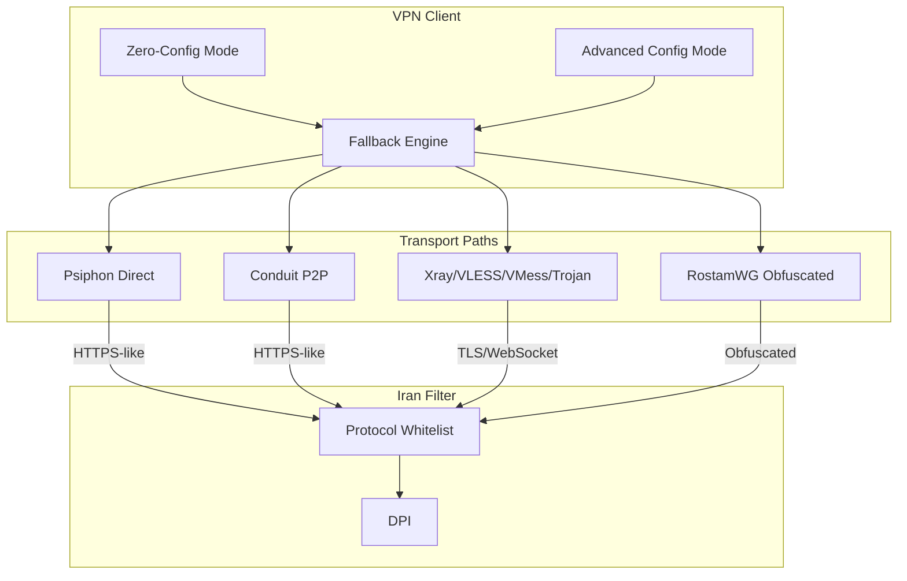

# PRD: Bullet-Proof Improved VPN for Iran Filtering Evasion

**Status:** Draft  
**Date:** February 2026  
**Project:** Iran-Circumvention VPN  
**Based on:** [Iran VPN Research Report 2026](report-iran-vpn-2026/README.md)

---

## 1. Introduction / Overview

### Problem

Iran maintains one of the world's most restrictive internet environments. Users face:

- **Multi-layered censorship:** DNS poisoning, DPI (Deep Packet Inspection), protocol whitelisting (only HTTP/HTTPS/DNS allowed), SNI filtering, UDP disruption
- **Scale:** Over 6 million domains blocked; major social media, messaging, and news outlets inaccessible
- **VPN detection:** Standard VPNs (OpenVPN, plain WireGuard) are detected and blocked by DPI
- **Legal risk:** Unauthorized VPN use is illegal in Iran (Supreme Council of Cyberspace, Feb 2024)

### Solution

Build or compose an open source VPN solution that reliably evades Iran's filtering infrastructure by:

- Using only HTTP/HTTPS/DNS as outer transport (protocol whitelist compliance)
- Obfuscating traffic to resemble legitimate web activity
- Supporting multiple transport paths with automatic fallback
- Integrating volunteer-powered P2P relay (Conduit-style) for resilience during shutdowns

---

## 2. Goals

- **DPI evasion:** Make VPN traffic indistinguishable from legitimate HTTPS
- **Protocol whitelist compliance:** All tunnels use HTTP, HTTPS, or DNS as outer transport
- **Resilience:** Automatic fallback across multiple protocols and paths when one fails
- **Availability:** Work during severe shutdowns when single-path solutions fail
- **Multi-platform:** Support Android, iOS, Windows, macOS
- **Zero-config for general users:** Connect without importing configs or servers
- **Advanced mode for power users:** Support VLESS/VMess/Trojan/WireGuard config import
- **Volunteer participation:** Enable diaspora to share bandwidth via low-friction P2P stations

---

## 3. User Stories

### US-001: Zero-config connection for general users

**Description:** As a non-technical user in Iran, I want to connect to the VPN with one tap/click so that I can access blocked social media, messaging, and news without configuring servers or importing configs.

**Acceptance Criteria:**

- [ ] User can launch the app and tap "Connect" without any prior setup
- [ ] App fetches server/config list automatically from decentralized or redundant sources
- [ ] Connection establishes within 30 seconds under typical conditions
- [ ] User sees clear "Connected" / "Disconnected" status
- [ ] No user account or login required
- [ ] Works on Android, iOS, Windows, macOS

### US-002: Automatic protocol fallback when path fails

**Description:** As a user in Iran, I want the VPN to automatically try the next working path when one fails so that I stay connected even when censorship blocks a specific protocol or server.

**Acceptance Criteria:**

- [ ] Fallback engine tries paths in order: Psiphon direct → Conduit P2P → Xray/Rostam (or user-defined)
- [ ] Fallback activates within 15 seconds of path failure
- [ ] User is notified of path switch (optional, non-intrusive)
- [ ] Connection resumes without user intervention
- [ ] Exponential backoff on repeated failures to avoid hammering

### US-003: Advanced config import for power users

**Description:** As a power user or activist, I want to import VLESS, VMess, Trojan, or obfuscated WireGuard configs so that I can use self-hosted or third-party servers with full control.

**Acceptance Criteria:**

- [ ] Support import of VLESS, VMess, Trojan configs (subscription URL or manual)
- [ ] Support import of obfuscated WireGuard (Rostam-style) configs
- [ ] Configs can be added alongside zero-config paths in fallback chain
- [ ] User can reorder or disable individual paths
- [ ] Config format validation with clear error messages

### US-004: Volunteer P2P station setup

**Description:** As a volunteer (diaspora or ally), I want to run a P2P relay station with minimal setup so that I can share bandwidth with users in Iran without complex configuration.

**Acceptance Criteria:**

- [ ] One-click or minimal-step install for Conduit-style station
- [ ] Works on Android (background), Windows, macOS (iOS planned)
- [ ] Volunteers cannot see user traffic content (encrypted end-to-end)
- [ ] Configurable bandwidth and battery limits
- [ ] Clear status: number of connected users, throughput
- [ ] Cure53 or equivalent security audit for P2P components

### US-005: Installer availability during outages

**Description:** As a user in Iran, I want to obtain the VPN installer and updates even when primary distribution sites are blocked so that I can install or update during shutdowns.

**Acceptance Criteria:**

- [ ] At least 2 alternate distribution channels (e.g., GitHub releases, mirror, direct link)
- [ ] Installers available via community-shareable links
- [ ] Update mechanism does not depend on a single domain
- [ ] Documentation includes pre-install recommendation (install before shutdown)

### US-006: DNS poisoning mitigation

**Description:** As a user, I want DNS queries to be protected from poisoning so that I can resolve blocked domains correctly when connected.

**Acceptance Criteria:**

- [ ] Integrate DNS-over-HTTPS (DoH) or equivalent when available
- [ ] Graceful handling when DoT/DoH are blocked (fallback to tunneled DNS)
- [ ] No DNS leaks when VPN is connected
- [ ] User option to choose DNS provider (default: privacy-preserving)

### US-007: Modular protocol support for future evolution

**Description:** As a maintainer, I want a modular architecture so that new protocols (e.g., Hy2, xHTTP) can be added quickly when censorship tactics evolve.

**Acceptance Criteria:**

- [ ] Protocol handlers are pluggable; adding a new protocol does not require major refactor
- [ ] OONI or Filter Watch–style measurement hooks for blocking visibility
- [ ] Documented protocol integration guide for contributors

### US-008: Legal disclaimer and operational security guidance

**Description:** As a user, I want clear information about legal risks and security best practices so that I can make informed decisions.

**Acceptance Criteria:**

- [ ] In-app and documentation: legal disclaimer (unauthorized VPN illegal in Iran; informational use only)
- [ ] Operational security recommendations: DoH, avoid public Wi-Fi, keep software updated
- [ ] No encouragement of illegal activity; users assume all risks
- [ ] Localized (Persian) guidance where applicable

---

## 4. Functional Requirements

### 4.1 Core Transport and Obfuscation

| ID | Requirement | Source |
|----|-------------|--------|
| FR-1 | All VPN tunnels MUST use HTTP, HTTPS, or DNS as outer transport (protocol whitelist) | [03-vpn-circumvention-techniques.md](report-iran-vpn-2026/03-vpn-circumvention-techniques.md) |
| FR-2 | Support traffic obfuscation: TLS/HTTPS encapsulation, HTTP prefixes, TLS fingerprint mimicry | Report Part 2 |
| FR-3 | Support protocol mimicry: VMess, VLESS, Trojan over TLS; WebSocket, gRPC, xHTTP, QUIC where applicable | Report Part 2 |
| FR-4 | Support obfuscated WireGuard (Rostam-style) as optional transport | [04-open-source-solutions.md](report-iran-vpn-2026/04-open-source-solutions.md) |
| FR-5 | Avoid detectable signatures: no plain OpenVPN, plain WireGuard, or known VPN fingerprints | Report Part 2 |

### 4.2 Multi-Protocol Fallback and Resilience

| ID | Requirement | Source |
|----|-------------|--------|
| FR-6 | Implement automatic protocol fallback: if one path fails, switch to next (e.g., direct Psiphon → Conduit → Xray/Rostam) | [07-complete-report-pros-cons-improvements.md](report-iran-vpn-2026/07-complete-report-pros-cons-improvements.md) §5.4 |
| FR-7 | Support volunteer-powered P2P relay (Conduit-style) to exploit pathways that cannot be fully blocked | Report §3.2 |
| FR-8 | Config and server-list distribution MUST be decentralized or redundant to resist blocking | Report §5.3 |
| FR-9 | Integrate DNS-over-HTTPS (or equivalent) to mitigate DNS poisoning; handle DoT/DoH blocking gracefully | [05-recommendations.md](report-iran-vpn-2026/05-recommendations.md) |

### 4.3 User Experience and Distribution

| ID | Requirement | Source |
|----|-------------|--------|
| FR-10 | Provide zero-config mode: users can connect without importing configs or servers | Psiphon, MahsaNG model |
| FR-11 | Provide advanced mode: users can import VLESS/VMess/Trojan/WireGuard configs | NikaNG, RostamWG model |
| FR-12 | Ensure installers and updates remain obtainable during outages (alternate distribution channels) | Report §5.2 |
| FR-13 | Support platforms: Android, iOS, Windows, macOS (desktop parity for Iran-specific clients) | Report §5.3 |

---

## 5. Non-Functional Requirements

### 5.1 Security and Privacy

| ID | Requirement |
|----|-------------|
| NFR-1 | All traffic end-to-end encrypted; no logging of user addresses or content |
| NFR-2 | Third-party security audit (Cure53-style) for critical components |
| NFR-3 | P2P relay design: volunteers cannot see user traffic content |

### 5.2 Reliability and Performance

| ID | Requirement |
|----|-------------|
| NFR-4 | Connection establishment within 30 seconds under typical conditions |
| NFR-5 | Automatic reconnection with exponential backoff on failure |
| NFR-6 | Optimize P2P throughput and multiplexing (target: improve on ~25 users/station) |

### 5.3 Maintainability and Evolution

| ID | Requirement |
|----|-------------|
| NFR-7 | Modular architecture to add new protocols as censorship tactics evolve |
| NFR-8 | OONI/Filter Watch–style integration for measurement and blocking visibility |

---

## 6. Non-Goals (Out of Scope)

- **Building a VPN protocol from scratch** — Use and extend existing protocols (Psiphon, Xray, RostamWG, Conduit)
- **Commercial VPN business model or monetization** — Open source, non-commercial focus
- **Circumvention for jurisdictions other than Iran** — Primary target is Iran; architecture may generalize but not in scope
- **User accounts or centralized identity** — Zero-config mode requires no signup
- **Guarantee of unblockability** — Censorship evolves; no tool can promise indefinite evasion

---

## 7. Design Considerations

### 7.1 UX Principles

- **Minimal friction:** General users should connect with one tap; no config import required
- **Progressive disclosure:** Advanced options available but not required
- **Status clarity:** Clear connected/disconnected; optional path indicator
- **Offline resilience:** Pre-install guidance; alternate distribution prominently documented

### 7.2 Platform Parity

- Android: Primary platform for Iran (MahsaNG, NikaNG precedent)
- iOS: Critical for reach; Conduit iOS support is a known gap
- Windows, macOS: Desktop parity for volunteers and power users

### 7.3 Relevant Existing Components

| Component | Role | Reuse |
|-----------|------|-------|
| Psiphon | Zero-config path | Integrate or deploy |
| Psiphon Conduit | P2P relay | Integrate or deploy |
| NikaNG / MahsaNG | Iran-specific client logic | Fork or reference |
| RostamWG | Obfuscated WireGuard | Integrate |
| Xray-core | VLESS, VMess, Trojan, gRPC | Integrate |

---

## 8. Technical Architecture

### 8.1 High-Level Flow

### 8.2 Recommended Building Blocks

| Component | Role | Notes |
|-----------|------|-------|
| Psiphon | Primary zero-config path | Obfuscated SSH, HTTP prefixes |
| Psiphon Conduit | P2P volunteer relay | Cure53 audited; >50% Iran traffic |
| Xray-core / V2Ray | VLESS, VMess, Trojan, gRPC, WebSocket | MPL-2.0 / MIT |
| RostamWG | Obfuscated WireGuard | Iran-focused; cross-platform |
| MahsaNG / NikaNG | Iran-specific client logic | Config distribution, protocol agility |

### 8.3 Build Strategy

- **Option A (Recommended):** Compose existing clients (Psiphon, Conduit, NikaNG, RostamWG) with a unified fallback layer and config distribution.
- **Option B:** Fork NikaNG or RostamWG; add Conduit integration, multi-protocol fallback, iOS/desktop support.
- **Option C:** New client wiring Xray + Rostam + Psiphon; higher effort; avoid unless A/B insufficient.

---

## 9. Success Metrics

| Metric | Target |
|--------|--------|
| Connection success rate | >90% under typical Iran conditions |
| Time to first byte | <5 s for web requests (when connected) |
| Fallback activation | <15 s to switch path on failure |
| Platform coverage | Android, iOS, Windows, macOS |
| Installer availability during outage | At least 2 alternate distribution channels |
| P2P throughput | Improve on ~25 users per volunteer station |

---

## 10. Risks and Mitigations

| Risk | Mitigation |
|------|------------|
| Iran blocks new distribution channels | Multiple mirrors; community-driven sharing; pre-install campaigns |
| DPI evolves to detect new obfuscation | Modular protocol stack; rapid updates; OONI measurement |
| Legal liability for users | Clear disclaimer; operational security guidance; no encouragement of illegal use |
| Volunteer P2P supply < demand | Volunteer drives; throughput optimization; integration with direct servers |
| Single maintainer dependency | Open source; multiple orgs (Psiphon Inc, MahsaNet, RostamVPN); funding diversification |

---

## 11. Legal and Safety Notice (Mandatory)

- Unauthorized VPN use is **illegal** in Iran (Supreme Council of Cyberspace, Feb 2024).
- This PRD and any resulting product must include: legal disclaimer, operational security recommendations (DoH, avoid public Wi-Fi, keep updated), and explicit statement that the product is for research/informational use; users assume all risks.

---

## 12. Open Questions

- Should fallback order be user-configurable or fixed by protocol robustness?
- What is the minimum viable set of protocols for v1 (Psiphon + Conduit only vs. full stack)?
- How to coordinate volunteer recruitment and status during Iran shutdowns?
- Should we pursue partnership with Psiphon Inc / MahsaNet for config distribution?
