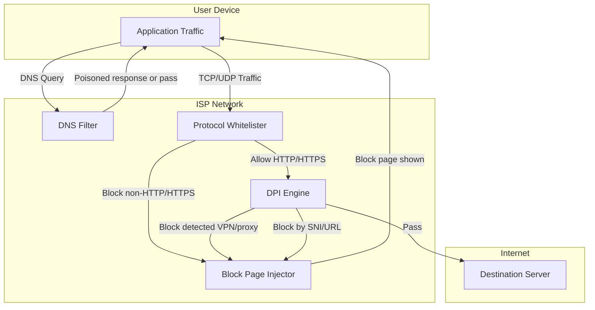

# Iran's Filtering System

## Technical Mechanisms

Iran's filtering system uses several complementary technical approaches to block content and detect circumvention tools.

| Mechanism | Description |
|-----------|-------------|
| **DNS poisoning** | Affects millions of IP addresses; blocks domains at resolution by returning incorrect or blocked IPs |
| **DPI (Deep Packet Inspection)** | Inspects packet headers and content in real time; detects VPN traffic by signatures; Iran uses protocol whitelisting (DNS, HTTP, HTTPS only) |
| **HTTP blockpage injection** | Injects blocking pages for HTTP requests to blocked domains |
| **HTTPS/SNI filtering** | Blocks by inspecting TLS SNI (Server Name Indication) in encrypted traffic |
| **UDP disruption** | Blocks or degrades UDP-based protocols (e.g., WireGuard, QUIC) |
| **Protocol whitelist** | Only DNS, HTTP, and HTTPS are permitted; other protocols are blocked at the network layer |

## Filtering Architecture

The following diagram illustrates how traffic is processed through Iran's censorship infrastructure:

## Scale and Scope

**Per 2024–2025 research:**

- Over **6 million** fully qualified domain names blocked
- Over **3.3 million** apex domains blocked
- Blanket blocking policies (e.g., entire country-code domains such as .il) causing collateral damage to unrelated sites

### Blocked Content Categories

- **Social media:** Facebook, X (Twitter), Instagram, YouTube, TikTok
- **Messaging:** Signal, WhatsApp, Telegram
- **News:** BBC Persian, Voice of America, and many international outlets
- **Other:** Encrypted DNS (DoT/DoH), app stores, circumvention tool distribution sites

## Legal and Policy Context

### VPN Ban (February 2024)

Iran's Supreme Council of Cyberspace (National Virtual Space Center), with endorsement from the Supreme Leader, outlawed unauthorized VPN usage. Only VPNs with a legal permit are allowed. Government-authorized VPNs likely include monitoring capabilities.

### Enforcement

- Harsh sentences for online speech (e.g., 12-year terms for minor interactions; death sentences for certain content)
- Prohibition of unlicensed VPN tools designed to bypass censorship

### Additional Strategies

- **Tiered internet:** Preferential, unfiltered access for approved groups (e.g., university students and faculty); stricter filtering for the general public
- **ISP price increases:** 30–40% rises to make global internet access more expensive and cumbersome

## Data Sources and Measurements

| Source | Description |
|--------|-------------|
| **OONI Explorer** | 40M+ measurements from Iran; [explorer.ooni.org/country/IR](https://explorer.ooni.org/country/IR) |
| **Freedom House** | Freedom on the Net 2024/2025 country reports |
| **Filter Watch** | Network and policy monitoring for Iran |
| **USENIX FOCI 20** | Academic research on Iran's protocol whitelister and evasion techniques |

## References

See [06-references.md](06-references.md) for full citations.
