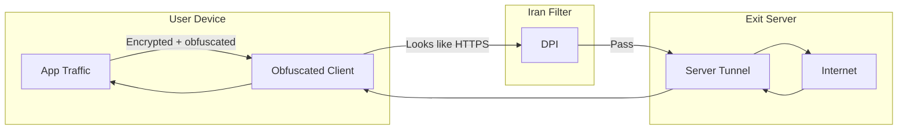

# VPN Circumvention Techniques

## Why Standard VPNs Fail

Iran's Deep Packet Inspection (DPI) infrastructure can identify VPN and circumvention traffic by inspecting packet structure and patterns, not just ports or protocols.

| VPN Type | Why It Fails |
|----------|--------------|
| **OpenVPN** | DPI recognizes OpenVPN encapsulation (the "OpenVPN container" differs from legitimate HTTPS) regardless of port (80, 443, 53) |
| **Plain WireGuard** | Distinct packet signature; WireGuard's fixed-size headers and structure are detectable |
| **Cloudflare WARP** | Cloudflare has restricted VPN/proxy abuse; v2ray over CDN is flagged as HTTP DDoS; mixed reliability in Iran |

### Protocol Whitelister

Iran uses a "censorship-in-depth" strategy. Beyond DPI, a protocol filter permits only:

- DNS
- HTTP
- HTTPS

Any other protocol (e.g., raw UDP for WireGuard, custom VPN encapsulations) is blocked before DPI even inspects it. This makes evasion more challenging than in environments with single-mechanism blocking.

## Effective Approaches

### 1. Traffic Obfuscation

- Tunnel VPN traffic over HTTPS so it resembles legitimate web traffic
- Use TLS/HTTPS for all VPN tunnels
- Apply HTTP prefixes or TLS fingerprinting to mimic browser behavior

### 2. Protocol-Level Evasion

- **TCP desync:** Manipulate packet boundaries so the censor's view of the stream differs from the endpoints'
- **Packet manipulation:** Stream-level modifications that evade inspection while preserving connection integrity
- **Protocol whitelister bypass:** Techniques documented in USENIX FOCI 20 research (e.g., Geneva project)

### 3. Protocol Mimicry

Use protocols that look like allowed traffic:

- **VMess, VLESS, Trojan** over TLS/HTTPS
- **WebSocket** over HTTPS (appears as normal web traffic)
- **gRPC** (HTTP/2-based)
- **xHTTP, QUIC** (where supported and not blocked)

## Circumvention Flow

Traffic is encrypted and obfuscated on the client, presented as HTTPS to the censor, decrypted and forwarded on the exit server, and returned to the user.

## Protocol and Design Requirements

For a VPN or proxy to work in Iran, it should:

1. **Respect the protocol whitelist** — Use HTTP, HTTPS, or DNS as the outer transport
2. **Avoid detectable signatures** — No OpenVPN, plain WireGuard, or other known VPN fingerprints
3. **Support obfuscation** — TLS, HTTP prefixes, or protocol mimicry
4. **Adapt over time** — Censorship tactics evolve; software and configs must be updated

## References

See [06-references.md](06-references.md) for full citations, including USENIX FOCI 20 and Geneva project resources.
