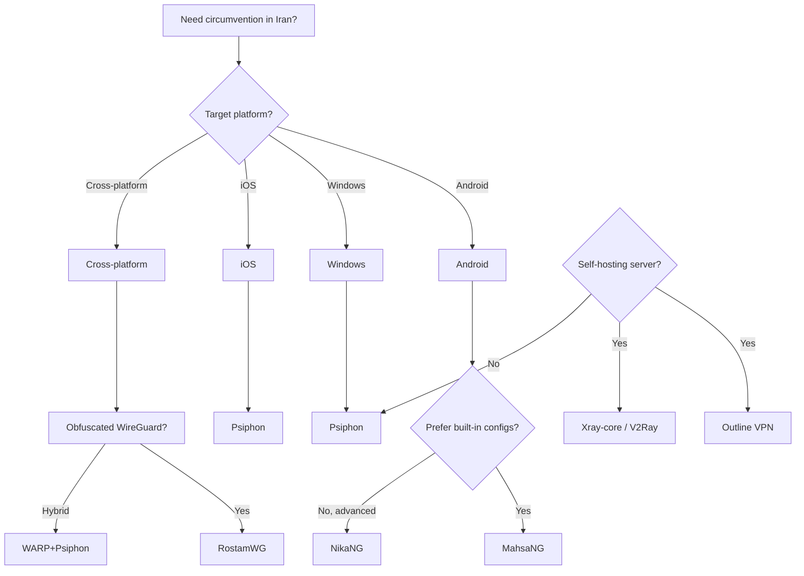

# Open Source Solutions

## Tool Selection Flow

## Tier 1: Free, Open Source, Actively Used in Iran

### Psiphon

| Attribute | Value |
|-----------|-------|
| **License** | Open source (GitHub) |
| **Platform** | Windows, Android, iOS |
| **Website** | [psiphon.ca](https://psiphon.ca) |

**Strengths:** Obfuscated SSH with unique obfuscation keys per server; HTTP prefixes to mitigate DPI classification; distributes server lists via S3 to avoid blocking; no user accounts; does not log user addresses. Operating since 2006.

### MahsaNG

| Attribute | Value |
|-----------|-------|
| **License** | Open source |
| **Platform** | Android |
| **Source** | [MahsaNet](https://mahsanet.com) |

**Strengths:** VPN client with built-in configs from Mahsa Server; uses VPN-Service permissions; designed for Iran; distributes third-party VPN configurations intelligently.

### NikaNG

| Attribute | Value |
|-----------|-------|
| **License** | Open source |
| **Platform** | Android |
| **Source** | [github.com/mahsanet/NikaNG](https://github.com/mahsanet/NikaNG) |

**Strengths:** Optimized fork of v2rayNG on Mahsa-Core; supports WARP, WireGuard Noise, Fragment; no built-in free configs (pure client); supports xhttp, QUIC, Hy2; Iran-focused.

### RostamWG

| Attribute | Value |
|-----------|-------|
| **License** | Open source |
| **Platform** | Cross-platform |
| **Source** | [github.com/RostamVPN/RostamWG](https://github.com/RostamVPN/RostamWG) |

**Strengths:** Obfuscated WireGuard implementation designed to bypass Iran's DPI.

### WARP+Psiphon (bepass-org)

| Attribute | Value |
|-----------|-------|
| **License** | MIT |
| **Platform** | Various |
| **Source** | [github.com/bepass-org/warp-plus](https://github.com/bepass-org/warp-plus) |

**Strengths:** Combines Cloudflare WARP and Psiphon for anti-censorship in Iran. Active forks: hiddify/warp-plus, victorgeel/psiphon-warp.

---

## Tier 2: Protocol Stacks and Clients

| Tool | Purpose |
|------|---------|
| **Xray-core** | VLESS, VMess, Trojan, XTLS; gRPC, WebSocket, xHTTP; full-featured proxy platform |
| **V2Ray** | VMess, VLESS, Trojan; traffic mimics HTTPS; predecessor to Xray |
| **Outline VPN** | Jigsaw (Alphabet); Shadowsocks-based; censorship-resistant; self-hosted; Apache-2.0 |
| **Shadowsocks** | Lightweight proxy; requires obfuscation/plugins for Iran |

---

## Tier 3: Iran-Specific Ecosystem

- **MahsaNet:** MahsaNG, NikaNG, Radar (monitoring tool for connection quality and VPN performance in restricted regions)
- **NekorayIR:** V2Ray/Xray client for Windows optimized for Iran; [github.com/XrayIran/nekorayIR](https://github.com/XrayIran/nekorayIR)

---

## Comparison Table

| Tool | License | Platform | Built-in Configs | Protocols | Iran-Specific |
|------|---------|----------|------------------|-----------|---------------|
| Psiphon | Open source | Win, Android, iOS | Yes | Obfuscated SSH, HTTP | General |
| MahsaNG | Open source | Android | Yes (Mahsa Server) | Various | Yes |
| NikaNG | Open source | Android | No | WARP, WG Noise, Fragment, xhttp, QUIC, Hy2 | Yes |
| RostamWG | Open source | Cross-platform | No | Obfuscated WireGuard | Yes |
| WARP+Psiphon | MIT | Various | Varies | WARP + Psiphon | Yes |
| Outline VPN | Apache-2.0 | Win, Mac, iOS, Android | No (self-host) | Shadowsocks | General |
| Xray-core | MPL-2.0 | Server/client | No | VLESS, VMess, Trojan, XTLS | General |
| V2Ray | MIT | Server/client | No | VMess, VLESS, Trojan | General |

---

## Setup and Usage Notes

### Psiphon

1. Download from [psiphon.ca](https://psiphon.ca) or app stores.
2. Launch and connect; no configuration required.
3. Server lists update automatically.

### MahsaNG

1. Download from [MahsaNet](https://mahsanet.com) or Google Play.
2. Open and connect; configs are provided by Mahsa Server.
3. Keep the app updated for new configs and protocols.

### NikaNG

1. Install from [GitHub releases](https://github.com/mahsanet/NikaNG/releases).
2. Import VLESS/VMess/Trojan configs or add WARP/WireGuard Noise servers.
3. Configure protocols (xhttp, QUIC, Fragment) as needed for your network.

### RostamWG

1. Obtain or self-host an obfuscated WireGuard server.
2. Install RostamWG client for your platform.
3. Import WireGuard config; obfuscation is applied automatically.

### Outline VPN (Self-Hosted)

1. Use Outline Manager to provision a server (DigitalOcean, GCP, AWS, or custom VPS).
2. Generate access keys and share with users.
3. Install Outline Client and add the key.

---

## References

See [06-references.md](06-references.md) for full citations and links.
